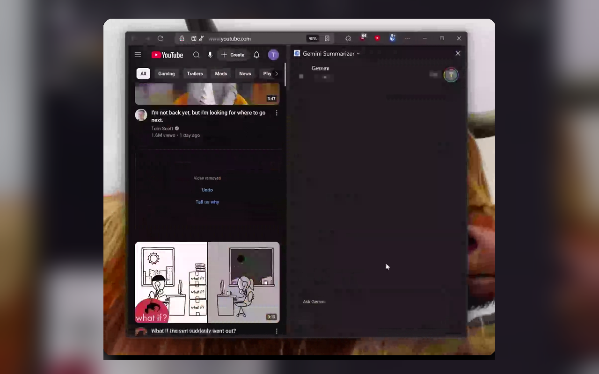

# YouTube Video Summarizer with Gemini

<p align="center">
  <a href="https://addons.mozilla.org/en-US/firefox/addon/gemini-yt-video-summarizer/">
    
  </a>
  <a href="https://github.com/TimStewartJ/yt-gemini-vid-summarizer/actions/workflows/package-extension.yml">
    
  </a>
  <a href="LICENSE">
    
  </a>
</p>

<p align="center">
  <a href="https://addons.mozilla.org/en-US/firefox/addon/gemini-yt-video-summarizer/"><strong>Install from Firefox Add-ons</strong></a>
</p>

<p align="center">
  <a href="https://timstewartj.com/assets/images/thumbnails/YtExtensionHero.webm">
    
  </a>
  <br>
  <sub>Click the preview to watch the short demo.</sub>
</p>

A focused Firefox add-on that opens Gemini in the sidebar with a YouTube video URL already added to your summary prompt. It is meant for quickly getting the gist of a video while keeping your browser flow intact.

## What it does

- Opens Gemini in Firefox's sidebar from a YouTube video page.
- Lets you right-click YouTube thumbnails and summarize videos without opening them first.
- Adds the selected YouTube URL to a customizable prompt template.
- Leaves YouTube alone: it does not mark videos as watched, click YouTube controls, or change your recommendations.

## Install

Install the listed version from Mozilla Add-ons:

[](https://addons.mozilla.org/en-US/firefox/addon/gemini-yt-video-summarizer/)

## How to use it

### From a YouTube video page

1. Open a YouTube video in Firefox.
2. Click the extension icon in the address bar.
3. Gemini opens in the sidebar with the video URL included in the summary prompt.

### From a YouTube thumbnail

1. Right-click a YouTube video thumbnail.
2. Choose **Summarize with Gemini**.
3. The sidebar opens with Gemini ready to summarize that video.

### Customize the prompt

1. Open `about:addons`.
2. Find **YouTube Video Summarizer with Gemini**.
3. Open **Options**.
4. Edit the prompt template. Use `{videoUrl}` where the YouTube URL should be inserted.

## Privacy

- The extension does not require data collection.
- It only handles YouTube video URLs needed for the summary workflow.
- It does not mark videos as watched.
- It does not modify your YouTube watch history or recommendations.

## Permissions

The extension requests these Firefox permissions:

- `activeTab` and `tabs`: detect the current YouTube page and open the sidebar workflow.
- `contextMenus`: add the right-click thumbnail action.
- `notifications`: confirm actions and show helpful status messages.
- `storage`: save your custom prompt template.
- `webRequest` and `webRequestBlocking`: pass the prepared prompt to Gemini when the sidebar opens.
- `*://gemini.google.com/*`: open and communicate with Gemini.

## Development

### Load locally

1. Clone the repository:

   ```bash
   git clone https://github.com/TimStewartJ/yt-gemini-vid-summarizer.git
   cd yt-gemini-vid-summarizer
   ```

2. Open Firefox and go to `about:debugging#/runtime/this-firefox`.
3. Click **Load Temporary Add-on...**.
4. Select `manifest.json` from this repository.

### Validate the extension

The repository does not require a package install for normal development. Use `web-ext` to lint and package the Firefox add-on:

```bash
npx --yes web-ext@latest lint --source-dir=. --ignore-files=README.md,LICENSE,.github/
npx --yes web-ext@latest build --source-dir=. --artifacts-dir=./dist --ignore-files=README.md,LICENSE,.github/ --overwrite-dest
```

### Project structure

- `manifest.json`: Firefox WebExtension manifest and permissions.
- `background.js`: page action, context menu, sidebar opening, and Gemini prompt handoff.
- `content.js`: YouTube page integration for thumbnail/right-click detection.
- `content-scripts/url-utils.js`: YouTube video URL parsing helpers.
- `sidebar.html` and `sidebar.js`: lightweight sidebar handoff page.
- `options.html` and `options.js`: prompt template settings.

## Release workflow

Publishing to [addons.mozilla.org](https://addons.mozilla.org/) is handled by GitHub Actions and documented in [`.github/RELEASE_WORKFLOW.md`](.github/RELEASE_WORKFLOW.md).

At a high level:

1. Run the **Prepare Release** workflow with a `patch`, `minor`, or `major` bump.
2. Review and merge the generated release PR.
3. Create and push the annotated `vX.Y.Z` tag from the merged `main` commit.
4. The tag-triggered package workflow validates the tag and submits the listed version to AMO with `web-ext sign`.

AMO may still run validation or review before the version is public.

## Known limitations

- Firefox-only. Other browsers require a separate port.
- Requires access to Gemini in Firefox.
- Gemini availability and responses are handled by Google.
- YouTube and Gemini page changes can affect extension behavior.

## Contributing

Issues and pull requests are welcome. Please test changes in Firefox against regular YouTube video pages and thumbnail-heavy pages such as Home, Search, and channel pages.

## License

MIT. See [LICENSE](LICENSE).
